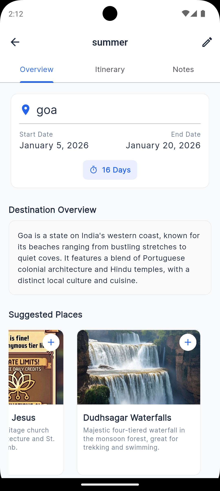
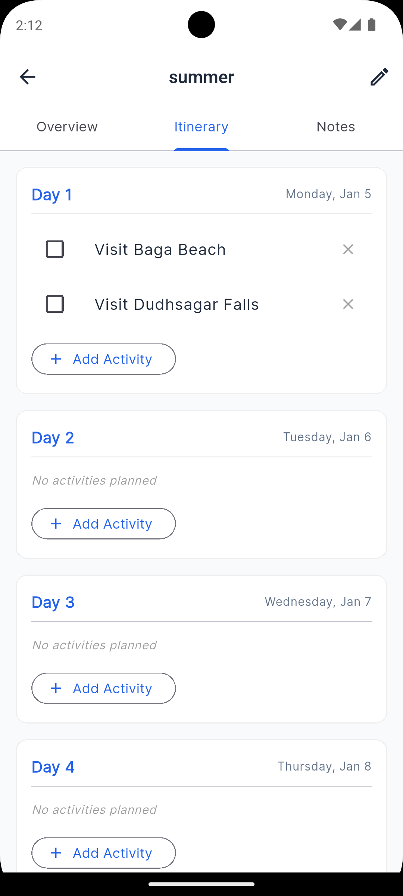
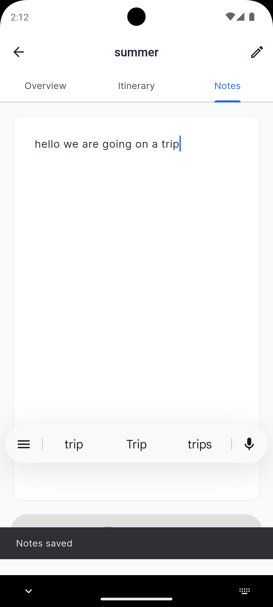

# TripNote ✈️

A beautiful, offline-first Flutter application to help you organize your trips, manage itineraries, and discover new places with the power of AI.

<p align="center">
  
  
  
  
  
</p>

## ✨ Features

- **Trip Management**: Create, edit, and delete trips with ease.
- **Detailed Itineraries**: Plan your trip day-by-day with a clean, checklist-style interface.
- **AI-Powered Insights**:
    - **Location Overview**: Get a quick, neutral summary of any destination.
    - **Suggested Places**: Discover must-visit spots with generated images and descriptions.
    - **Smart Add**: Instantly add suggested places to your itinerary with one tap.
- **Offline First**: All your data is stored locally using Hive. The app works perfectly without internet (except for AI features).
- **Notes**: Keep track of important details, ideas, or memories for each trip.
- **Beautiful UI**: A clean, modern interface designed with Google Fonts (Inter) and a professional color palette.

## 🛠️ Tech Stack

- **Framework**: [Flutter](https://flutter.dev/)
- **Language**: Dart
- **State Management**: [Provider](https://pub.dev/packages/provider)
- **Local Storage**: [Hive](https://pub.dev/packages/hive)
- **AI Integration**: [OpenRouter API](https://openrouter.ai/) (using Google Gemini & Mistral models)
- **Image Generation**: [Pollinations.ai](https://pollinations.ai/)
- **Date Formatting**: [intl](https://pub.dev/packages/intl)

## 🚀 Getting Started

### Prerequisites

- Flutter SDK installed (Version 3.0.0 or higher)
- Dart SDK installed
- An IDE (VS Code or Android Studio)

### Installation

1.  **Clone the repository**:
    ```bash
    git clone https://github.com/yourusername/travel-planner.git
    cd travel_planner
    ```

2.  **Install dependencies**:
    ```bash
    flutter pub get
    ```

3.  **Configure API Key**:
    - This project uses OpenRouter for AI features.
    - Create a file named `env.dart` in `lib/core/`.
    - Add your API key as follows:
      ```dart
      // lib/core/env.dart
      class Env {
        static const String openRouterApiKey = 'YOUR_OPENROUTER_API_KEY_HERE';
      }
      ```
    - **Important**: Ensure `lib/core/env.dart` is added to your `.gitignore` to prevent leaking your key.

4.  **Run the app**:
    ```bash
    flutter run
    ```


## 🤝 Contributing

Contributions are welcome! Please feel free to submit a Pull Request.

## 📄 License

This project is licensed under the MIT License - see the [LICENSE](LICENSE) file for details.
